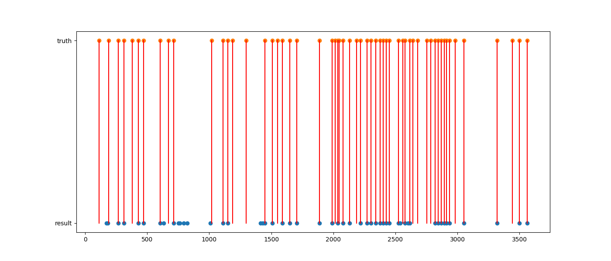
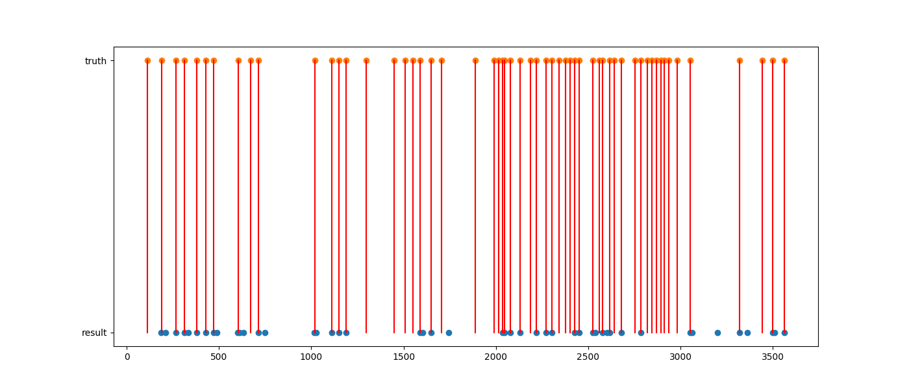
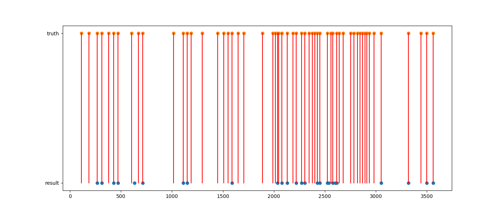
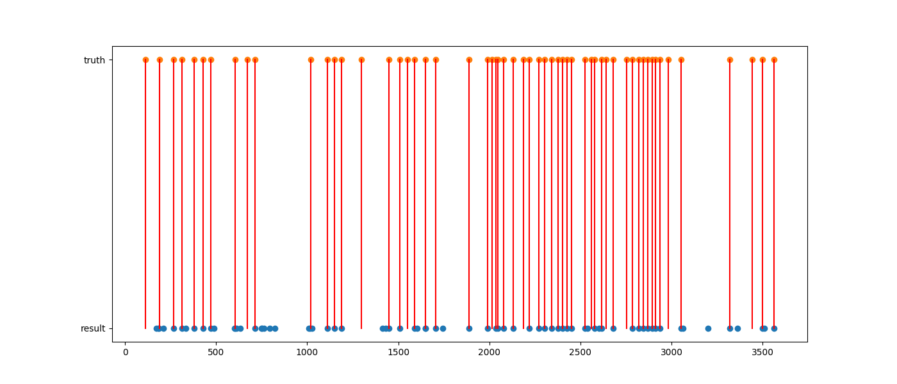

## Video shot detection

1.Color histogram

```
python3 main.py --hist <threshold>
```



2.Moment invariants

```
python3 main.py --moment <threshold>
```



3.Intersect

```
python3 main.py --mix 2 --hist <threshold1> --moment <threshold2>
```



4.Union

```
python3 main.py --mix 1 --hist <threshold1> --moment <threshold2>
```



